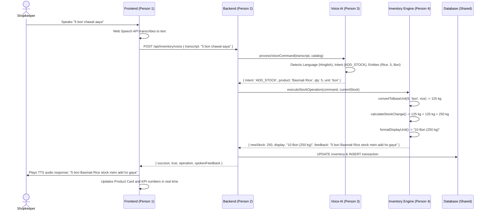

# System Architecture: Voice-Based Inventory Management

## Executive Summary
Many small businesses and Kirana store owners in India manage inventory mentally or in paper notebooks. Complex ERP software requires extensive typing, technical jargon in English, and rigid standard units that do not reflect everyday trade reality (bags, sacks, crates, dozens, quintals).

This solution provides a **voice-first, multilingual, trade-unit native inventory platform** architected around 4 collaborative roles:

```
+-----------------------------------------------------------------------------------+
|                                 USER INTERFACE                                    |
|   👤 Person 1: Frontend (React 18 + Vite + Tailwind CSS + Web Speech API)        |
|   - Mobile-First Kirana Dashboard                                                 |
|   - Real-time pulsating Voice Mic & Text-To-Speech (TTS) Feedback                 |
|   - Trade Unit representations ("5 Bori 10 kg") & 1-Click Adjustments             |
+------------------------------------------+----------------------------------------+
                                           | HTTP / REST (JSON)
                                           v
+-----------------------------------------------------------------------------------+
|                                 BACKEND API                                       |
|   👤 Person 2: Backend (Node.js + Express + SQLite / WAL)                         |
|   - REST Controllers: Auth, Products, Inventory, Transactions, Alerts             |
|   - Audit logging of spoken voice transcripts & detected languages                |
|   - Transaction rollback & undo support                                           |
+---------------------+-------------------------------------+-----------------------+
                      |                                     |
                      v                                     v
+------------------------------------+    +-----------------------------------------+
|     👤 Person 3: Voice AI Service  |    |    👤 Person 4: Inventory Engine        |
|  - Language Detection (Hindi,      |    |  - Indian Trade Unit Definitions        |
|    Hinglish, Tamil, Telugu, Eng)   |    |    (bori, quintal, peti, dozen, pkt)    |
|  - Intent Parser (ADD, SELL,       |    |  - Bidirectional Unit Converter         |
|    QUERY, ALERTS, SUMMARY)         |    |  - Stock Math & Availability Validation |
|  - Indian Phonetic & Levenshtein   |    |  - Threshold Alerts & Reorder Suggestion|
|    Entity Extractor                |    |  - Plain-Language Audio Summarizer      |
|  - Gemini AI fallback engine       |    |                                         |
+------------------------------------+    +-----------------------------------------+
                      \                                     /
                       \                                   /
                        v                                 v
+-----------------------------------------------------------------------------------+
|                         🗄️ Shared Relational Database                             |
|   SQLite with WAL mode (Auto-migrating schema.sql & seed.sql)                     |
|   - users, products (with JSON regional aliases), inventory, transactions, alerts |
+-----------------------------------------------------------------------------------+
```

---

## Component Interaction Flow

### 1. Voice Stock Inward Example: *"5 bori chawal aaya"*


---

## Trade Unit Mechanics
Small business owners think in packages rather than raw grams:
- **Bori / Bag / Katta**: 1 bori of Basmati Rice = 25 kg; 1 bori of Atta = 50 kg; 1 bori of Sugar = 50 kg.
- **Peti / Carton**: 1 peti of Mustard Oil = 12 litres; 1 peti of Soap = 48 pieces.
- **Dozen / Darjan**: 1 dozen eggs = 12 pcs.
- **Quintal / Palla**: 1 quintal of bulk potatoes/onions = 100 kg.
- **Packet / Pouch**: 1 packet of milk = 0.5 litre; 1 packet of tea = 250 g.

The system internally tracks stock in scientific base units (`kg`, `pcs`, `litre`) while presenting and receiving all operations in the store owner's customary trade terms.
